# react-blender-panels

Blender-style panels for React. Give it a div to fill and it splits into panels you can resize by
dragging an edge, and split or join by dragging a corner.

**[Docs and demo](https://reactblenderpanels.com)**



```
npm install react-blender-panels
```

```tsx
import { Panels } from 'react-blender-panels'
import type { Panel } from 'react-blender-panels'

const [panels, setPanels] = useState<Panel[]>([
  { id: 'viewport',   x: 0,   y: 0,   w: 0.7, h: 1   },
  { id: 'outliner',   x: 0.7, y: 0,   w: 0.3, h: 0.4 },
  { id: 'properties', x: 0.7, y: 0.4, w: 0.3, h: 0.6 },
])

<div style={{ width: '100%', height: 500 }}>
  <Panels value={panels} onChange={setPanels}>
    {(panel) => <div>{panel.id}</div>}
  </Panels>
</div>
```
